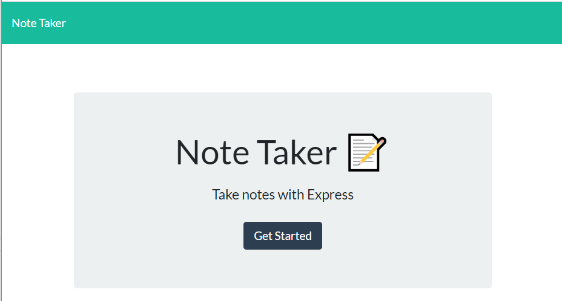
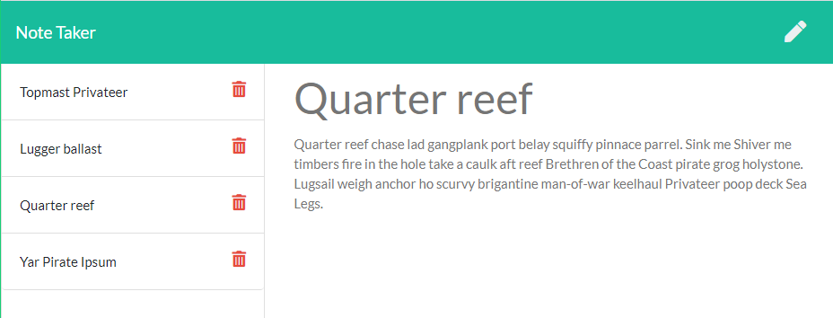

# Note Archive

  

## Description

A program to take, store, find, and delete notes.

Link to live site: [Note Archive](https://clarissareeve.github.io/NoteArchive/)

## Table of Contents

* [Installation](#installation)
* [Usage](#usage)
* [Contributing](#contributing)
* [License](#license)
* [Questions](#questions)

## Installation

If running locally, run `npm init` to install dependencies. Application is invoked with command: `node server.js` or `npm start`.

## Usage

On the [live page] click 'Get Started' to begin. The pencil icon in the upper left hand corner lets you add a new note. The trash can icon next to the title deletes the selected note.

## License

The Unlicense

Copyright (c) 2020 Clarissa Reeve

## Contributing

When contributing to this repository, please first discuss the change you wish to make via issue, email, or any other method with the owner(s) of this repository before making a change.

## Questions

For any questions the author can be contacted at:

GitHub: @[clarissareeve](https://github.com/clarissareeve)

Email: clarissa.reeve@gmail.com
